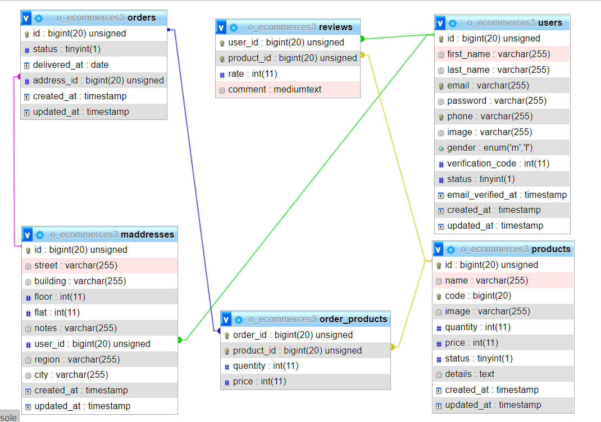
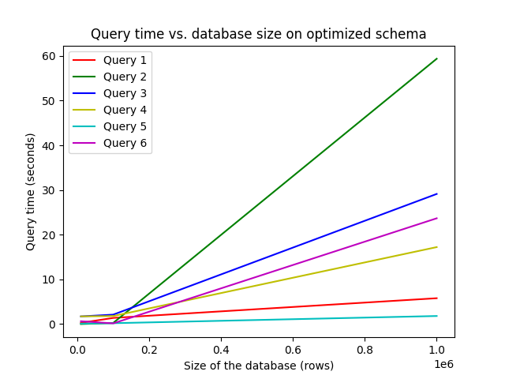
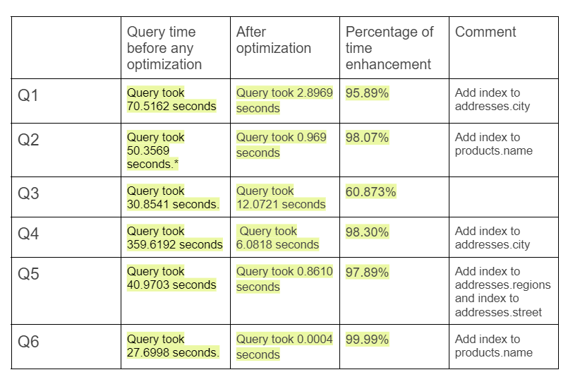

<H1>
📊 Database Tuning
</H1>

## 📌 Introduction

We experiment with the different concepts of database tuning and the different techniques used like:
<ul>
<li> Optimizing the schema. </li>
<li> Optimizing the memory requirements. </li>
<li> Optimizing the queries. </li>
<li> Testing the performace of MySQL vs MongoDB.</li>
<ul>

## 📌 Database Schema

## 📌 Results

### MySQL Performance

### MySQL vs MongoDB Performance

### Effects of combine all optimizations 

## 📌 Conclusion

- Query optimization has an effect when the DBMS didn’t optimize the query and reorder the join to get min cost.

- Index the table reduces the time for selection and grouping by on the value which has the index,  also when joining on the foreign key it reduces the time when there is an index.

- Increasing the buffer pool increases the number of pages cached in the buffer pool which reduces the time of the query.

### 📌 For more details check the [report](./2_report.pdf)